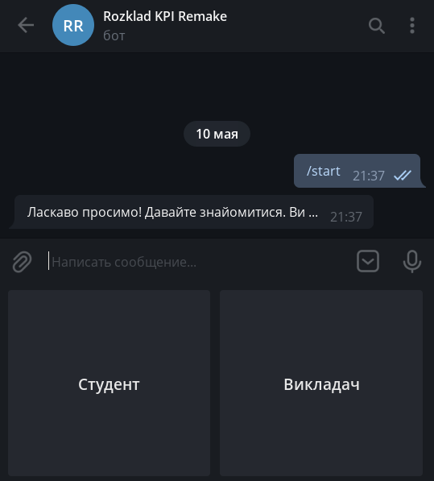

# rozklad_kpi_bot. Пояснювальна записка

## Зміст
1. [Вступ](#вступ)
2. [Технічне завдання](#технічне-завдання)
4. [Проектування](#проектування-програмного-додатку)
5. [Розробка](#розробка)
6. [Тестування](#тести)
7. [Висновки](#висновки)

## Вступ

У цьому документі є опис процесу розробки системи доступу до розкладу, що розробляється в рамках лабораторних робіт з предмета ІПЗ-2.

### Мета

Метою документа є з'ясування основних вимог до функціональності та експлуатаційної придатності, а також визначення бізнес-правил і можливих технологічних обмежень предмета розробки.

### Контекст

Перелік вимог, перерахованих в цьому документі, є основою технічного завдання на розробку системи доступу до розкладу "rozklad_kpi_bot".

## Технічне завдання

### Загальне завдання
Розробити систему, що надає користувачу(студенту або викладачу) доступ до його розкладу або розкладу його групи. Система повинна бути реалізована у вигляді телеграм боту.

### Функціональність системи

#### Інтерфейс студента
Функціональний простір облікового запису студента має надавати можливості доступу до розкладу. Надаються можливості:
 - переглядати розклад на сьогодні/завтра/цей тиждень або весь розклад;
 - створювати запит на додаткову пару по одному із предметів, зазначених у розкладі;
 - підтримувати вже створений запит.

#### Інтерфейс викладача
Функціональний простір облікового запису викладача має надавати можливості доступу до розкладу. Надаються можливості:
 - переглядати розклад на сьогодні/завтра/цей тиждень або весь розклад;
 - переглядати запити студентів щодо консультації;
 - приймати запит та обирати зручний час із запропонованих системою.


## Проектування програмного додатка

### Діаграма юзкейсів


### Категорії користувачів

В системі існує дві категорії користувачів: студент та викладач.

**Студент:** може доступатися до розкладу власної групи, пропонувати викладачу провести додаткову пару.

**Викладач:** може доступатися до власного розкладу, приймати або відхиляти пропозицію щодо додаткової пари.

### Студент

#### Сценарій №1

***ID:*** SDT.01
       
***НАЗВА:*** Дізнатися розклад

***УЧАСНИКИ:*** Студент

***ПЕРЕДУМОВИ:*** Розклад сформовано

***РЕЗУЛЬТАТ:*** Студент знає свій розклад

***ВИКЛЮЧНІ СИТУАЦІЇ:***
 - EХ.001.001: Розклад ще не сформовано 

***ОСНОВНИЙ СЦЕНАРІЙ:*** 
1. Студент дізнається свій розклад


#### Сценарій №2

***ID:*** SDT.02
       
***НАЗВА:*** Запропонувати викладачу провести додаткову пару

***УЧАСНИКИ:*** Студент, викладач

***ПЕРЕДУМОВИ:*** Студент хоче мати додаткову консультацію з викладачем

***РЕЗУЛЬТАТ:*** Викладач дізнався, що студентам потрібна консультація

***ОСНОВНИЙ СЦЕНАРІЙ:*** 
1. Студент створює запит на консультацію з викладачем.
2. Інші студенти підтримують цей запит.
3. Викладач бачить, що студентам потрібна консультація.


#### Сценарій №3

***ID:*** SDT.03
       
***НАЗВА:*** Підтримати запит на додаткову пару

***УЧАСНИКИ:*** Студент

***ПЕРЕДУМОВИ:*** Студент хоче мати додаткову консультацію з викладачем(запит вже створено)

***РЕЗУЛЬТАТ:*** Викладач дізнався, що студентам потрібна консультація

***ОСНОВНИЙ СЦЕНАРІЙ:*** 
1. Студент підтримує запит.
2. Викладач бачить збільшену кількість студентів, котрим потрібна консультація.


### Викладач

#### Сценарій №1

***ID:*** TCR.01
       
***НАЗВА:*** Дізнатися розклад

***УЧАСНИКИ:*** Викладач

***ПЕРЕДУМОВИ:*** Розклад сформовано

***РЕЗУЛЬТАТ:*** Викладач знає свій розклад

***ВИКЛЮЧНІ СИТУАЦІЇ:***
 - EХ.001.001: Розклад ще не сформовано 

***ОСНОВНИЙ СЦЕНАРІЙ:*** 
1. Викладач дізнається свій розклад


#### Сценарій №2

***ID:*** TCR.02
       
***НАЗВА:*** Прийняти запит на додаткову пару

***УЧАСНИКИ:*** Викладач, студент

***ПЕРЕДУМОВИ:*** Студент створив запит на додаткову пару

***РЕЗУЛЬТАТ:*** Викладач прийняв запит та назначив час проведення консультації

***ОСНОВНИЙ СЦЕНАРІЙ:*** 
1. Викладач бачить список предметів, з яких студенти хочуть провести додаткові пари.
2. Викладач обирає пару, яку, як він вважає, треба провести.
3. Викладач обирає час проведення додаткової пари
                       
## Розробка

Система розроблена мовою програмування `python` з використанням пакету `pyTelegramBotAPI` та бази даних `sqlite`.

В системі не реалізовано функції взаємодії студентів із викладачами. Причина: необхідний для взаємодії сервер ще не завершено на етапі написання цього документа.

### Структура БД


База даних зберігає в собі інформацію про користувачів: їх налаштування щодо розкладу. Таблиці `teachers` та `groups` зберігають посилання на розклад для конкретних груп та викладачів.

### Бібліотека для Telegram API

`pyTelegramBotAPI` надає можливості щодо зручного користування API Telegram.
Більш детально з пакетом можна ознайомитись на [сторінці проекта](https://github.com/eternnoir/pyTelegramBotAPI) на github.

Із документацією до коду можна ознайомитись за посиланням.

### Інтерфейс користувача

Інтерфейс користувача текстовий, як і в усіх ботах. Проте, було реалізовано метод, що відображає кнопки вибору(студент чи викладач) при реєстрації.



### Документація

Було розроблено документацію до коду, що знаходиться за посиланням: https://drewg3r.github.io/rozklad_kpi_bot/

Було використано систему автоматичного документування коду [pdoc](https://github.com/pdoc3/pdoc).

## Тестування

Тестувати Telegram бота в цілому використовуючи обрану мною бібліотеку майже неможливо. Тому було прийнято рішення винести всю логіку відповідей у окремий модуль та тестувати саме його. 

Результат виконання `pytest`:
```
============================= test session starts ==============================
platform linux -- Python 3.8.5, pytest-6.2.3, py-1.10.0, pluggy-0.13.1
rootdir: rozklad_kpi_bot
collected 8 items                                                              

../tests/unit/test_generator.py ........                                 [100%]

============================== 8 passed in 0.92s ===============================

```
Тобто тестування логіки пройшло успішно.

## Висновки
В результаті проходження курсу ІПЗ-2 було розроблено систему для отримання викладачами і студентами НТУУ "КПІ" їх розкладу. Система досить гнучка: до неї можна додавати розклади редагуючи базу даних.

До системи розроблено документацію та налаштовано комплекс для її тестування.

